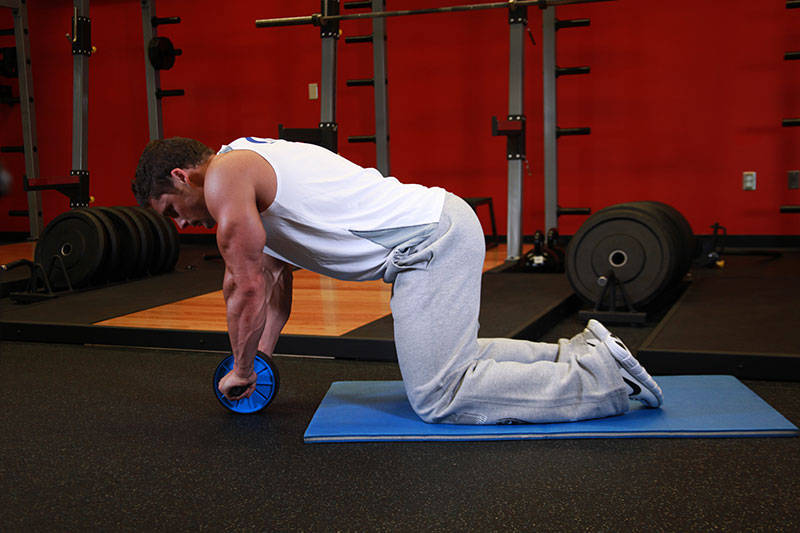
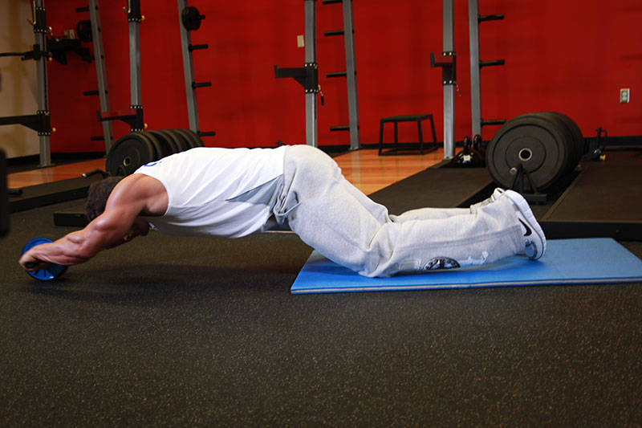

# Ab Wheel Rollout

 

## Cues

Pelvis tucked; stop before the lower back arches.

## Setup

Kneel holding the ab wheel on the floor below your shoulders, core braced and hips tucked under.

## Steps

1. Roll forward slowly, only as far as you can without your lower back sagging.
2. Pull back to the start using your abs.
