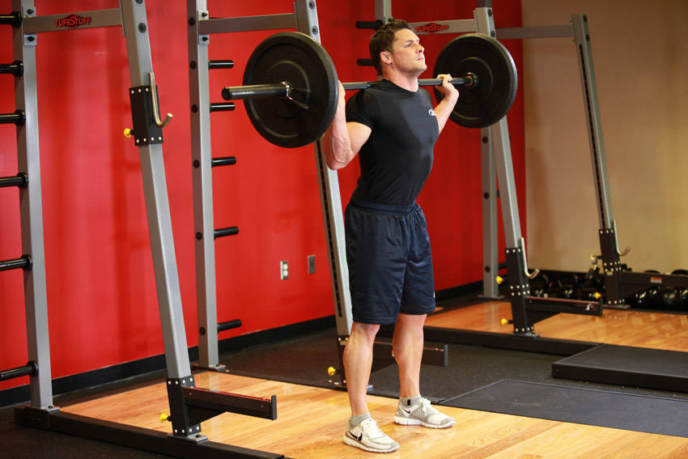
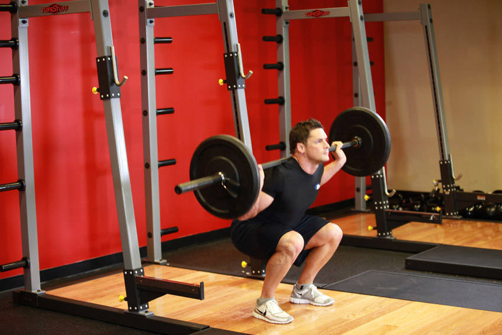

# Back Squat

 

## Cues

Knees in line with the toes; hips to knee height or lower.

## Setup

Set the bar across your upper back and step back, feet about shoulder-width apart, toes slightly out.

## Steps

1. Breathe in and brace your core.
2. Sit down and back, knees tracking over your toes, until your hips are at least level with your knees.
3. Drive up through your whole foot, keeping your chest up.
