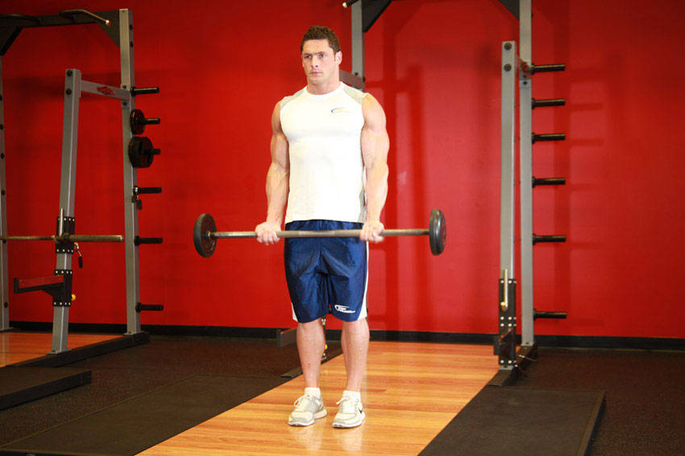
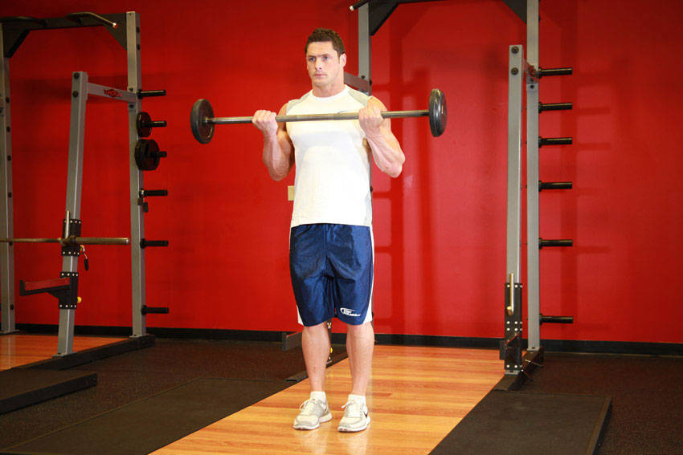

# Barbell Curl

 

## Cues

Elbows fixed at the sides; torso does not move.

## Setup

Stand holding the bar with an underhand, shoulder-width grip, elbows pinned to your sides.

## Steps

1. Curl the bar up to your shoulders without swinging your body.
2. Lower slowly until your arms are fully straight.
