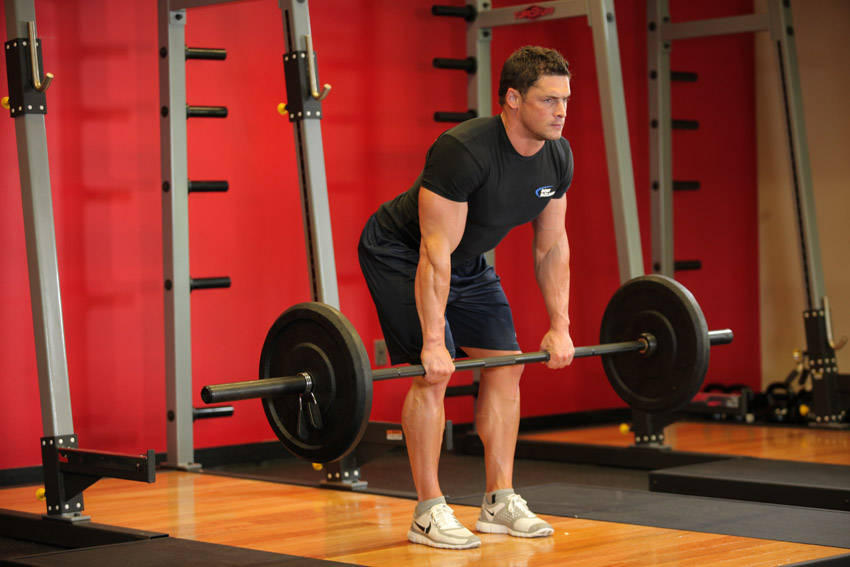
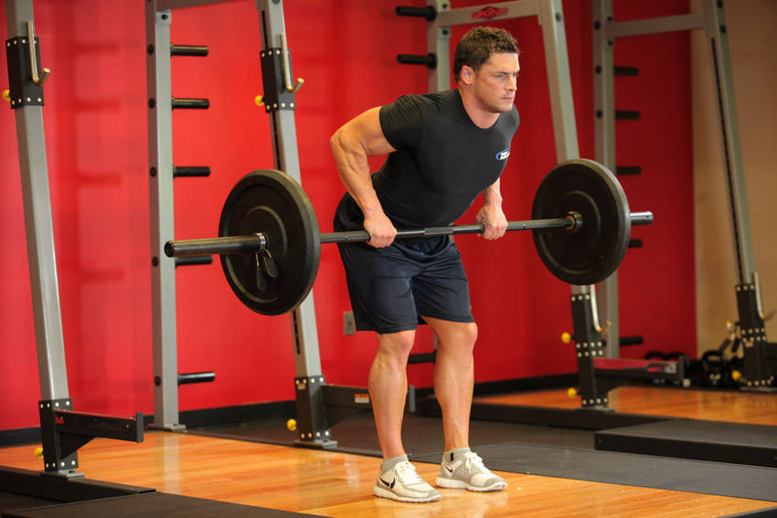

# Barbell Row

 

## Cues

Torso at 45° to the floor, bar to the lower ribs.

## Setup

Hold the bar with an overhand grip, hands just outside your knees, and hinge until your torso is at about 45°, back flat and knees soft.

## Steps

1. Pull the bar to your lower ribs, driving your elbows back.
2. Lower under control without letting your torso rise.
