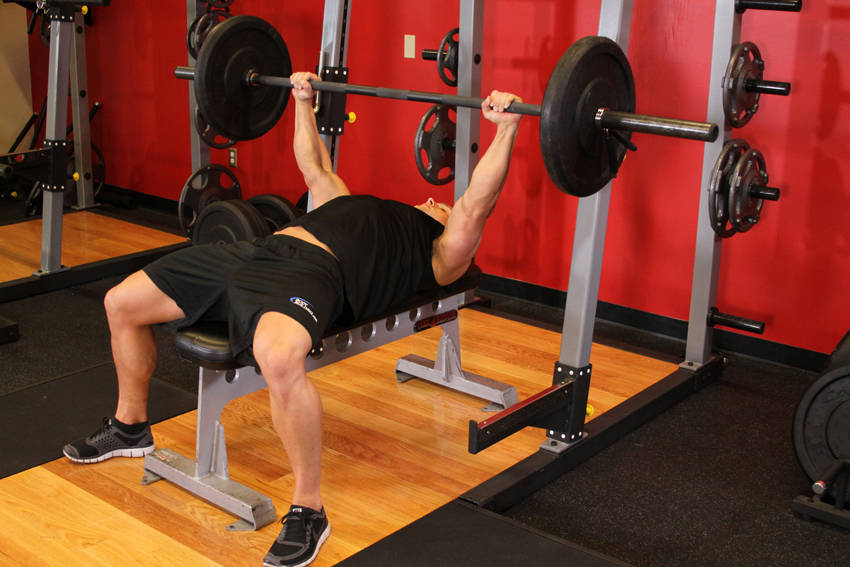
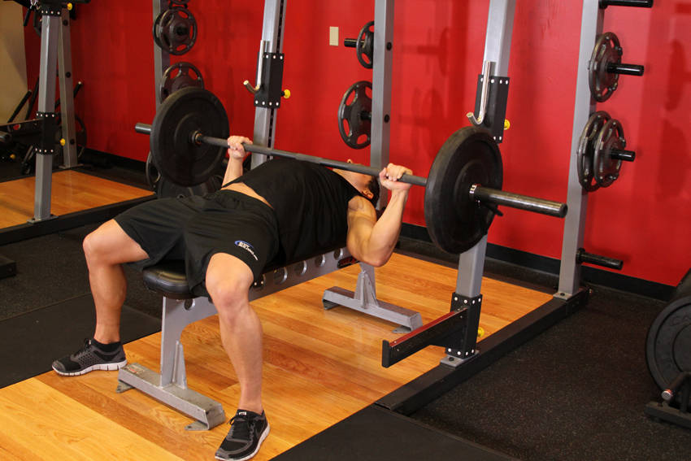

# Bench Press

 

## Cues

Shoulder blades pulled back, feet flat on the floor, bar to mid-chest.

## Setup

Lie with your eyes under the bar, feet flat, shoulder blades squeezed back and down, hands just outside shoulder width.

## Steps

1. Unrack the bar and hold it over your shoulders with straight arms.
2. Lower the bar under control to your mid-chest, elbows about 45° from your body.
3. Press up and slightly back towards your face until your arms are straight.
