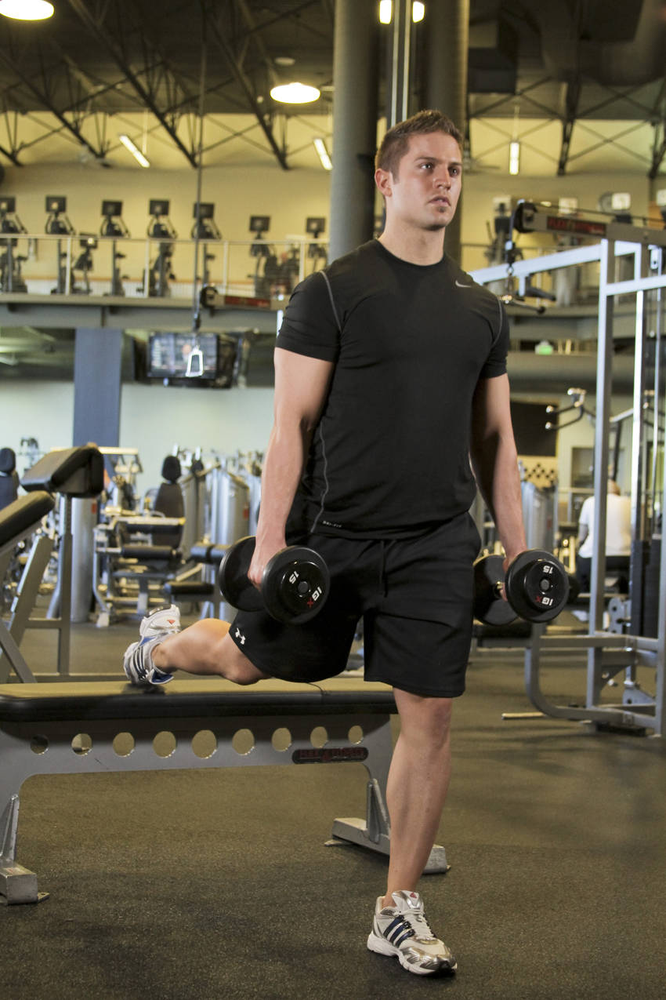
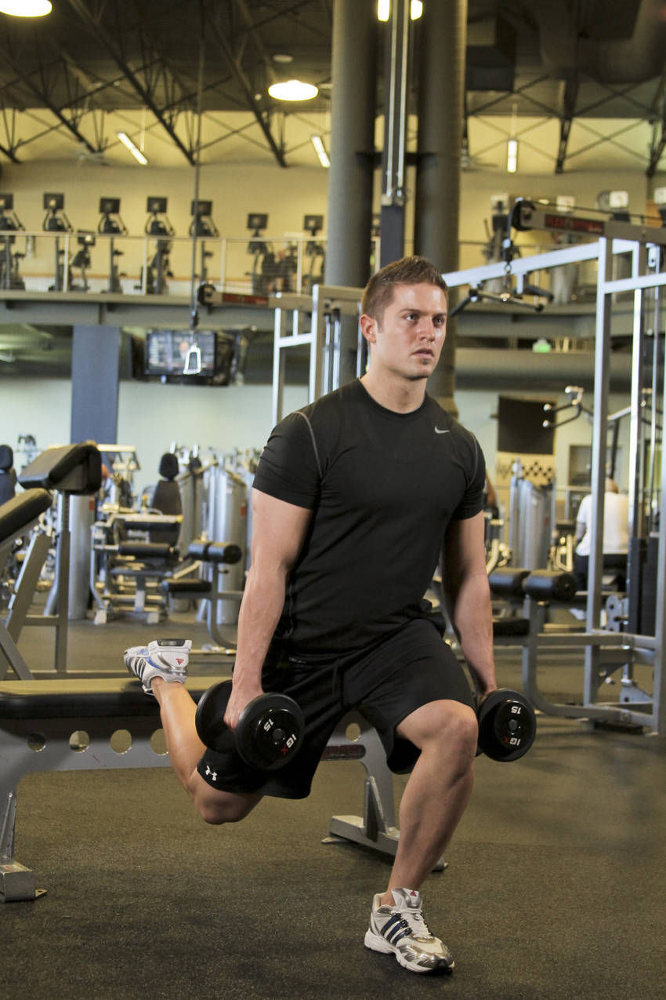

# Bulgarian Split Squat

 

## Cues

Rear foot on a bench; front knee above the middle of the foot.

## Setup

Stand a long stride in front of a bench with a dumbbell in each hand, and rest the top of your back foot on the bench.

## Steps

1. Lower straight down until your back knee nearly touches the floor, keeping your front knee over your mid-foot.
2. Push through your front foot to stand, torso upright or leaning slightly forward.
3. Switch legs after the set.
