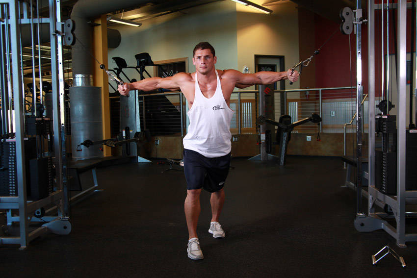
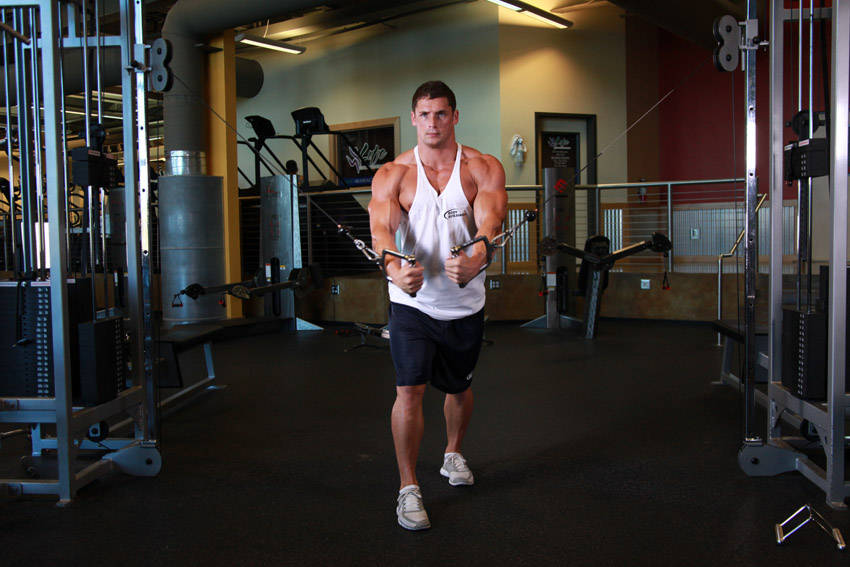

# Cable Crossover

 

## Cues

Elbows bent 15–20°; hands meet in front of the lower chest.

## Setup

Set both pulleys high, take a handle in each hand and step forward into a split stance, arms out wide with a slight bend in the elbows.

## Steps

1. Bring the handles down and together in front of your hips in a wide arc.
2. Squeeze for a moment.
3. Return slowly along the same arc until you feel a stretch across your chest.
