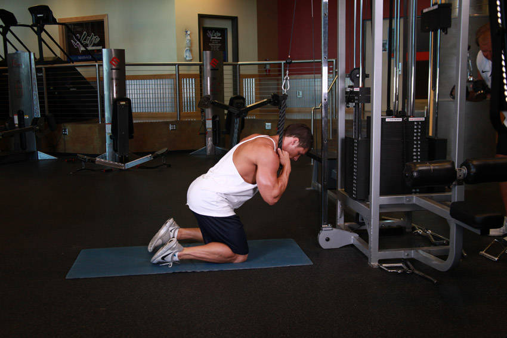
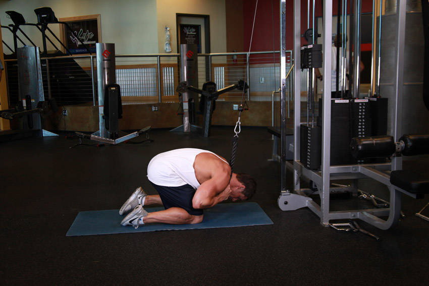

# Cable Crunch

 

## Cues

Hips stay still; the ribs move towards the pelvis.

## Setup

Attach a rope to a high pulley and kneel below it, holding the rope beside your head.

## Steps

1. Keeping your hips still, crunch down by rounding your spine, bringing your ribs towards your hips.
2. Return slowly until your abs are stretched.
