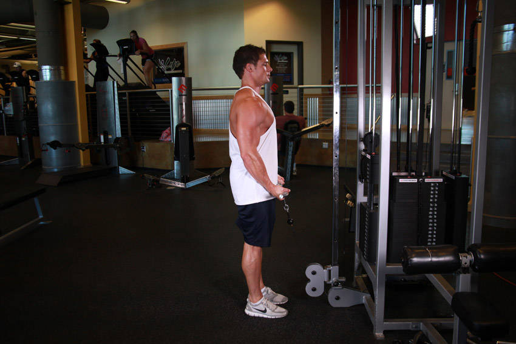
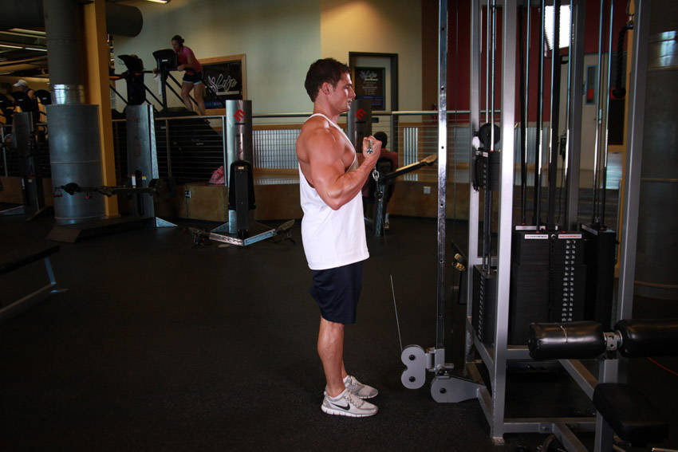

# Cable Curl

 

## Cues

Elbows fixed at the sides.

## Setup

Attach a straight bar to a low pulley, hold it with an underhand grip and stand tall with your elbows at your sides.

## Steps

1. Curl the bar up to your shoulders and squeeze.
2. Lower slowly, keeping tension on the cable.
