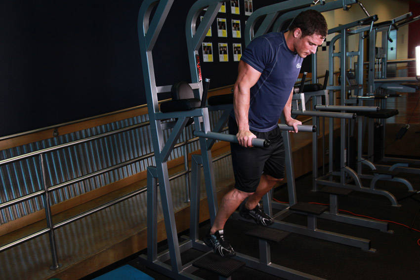
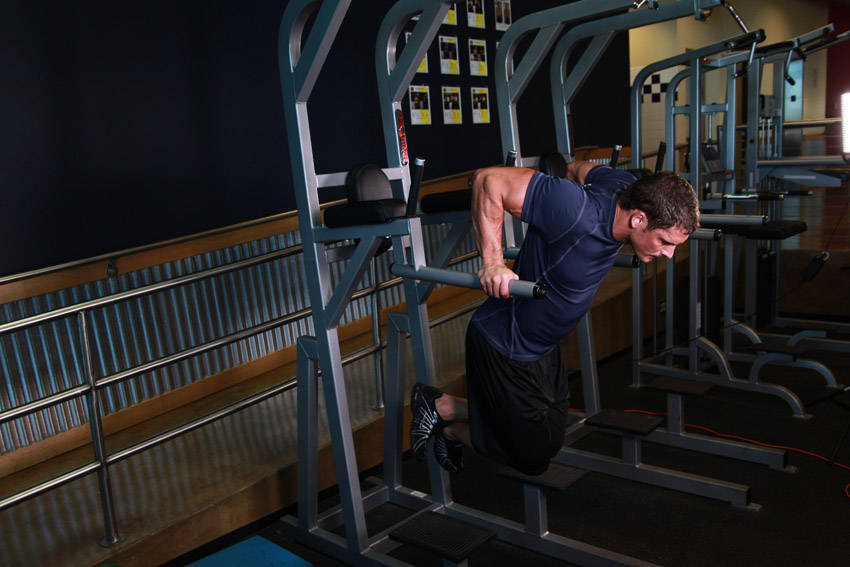

# Chest Dip

 

## Cues

Torso leaning forward 30° to load the chest.

## Setup

Support yourself on the bars with straight arms, torso leaning forward and knees slightly bent.

## Steps

1. Lower until your upper arms are about parallel to the floor, letting your elbows flare a little.
2. Press back up to straight arms, keeping the forward lean.
