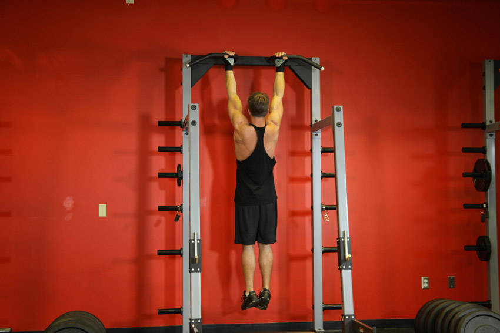
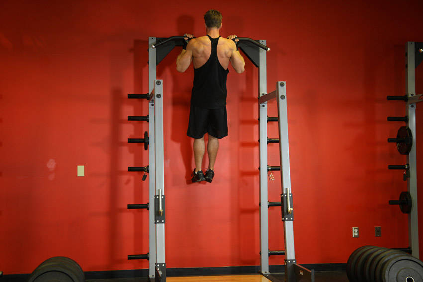

# Chin-Up

 

## Cues

Palms facing the body; chin above the bar.

## Setup

Hang from the bar with an underhand grip, hands shoulder-width apart.

## Steps

1. Pull your shoulder blades down, then pull yourself up.
2. Go up until your chin clears the bar.
3. Lower all the way to straight arms under control.
