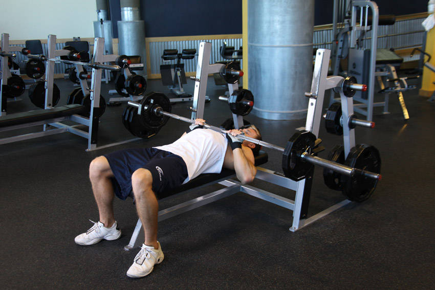
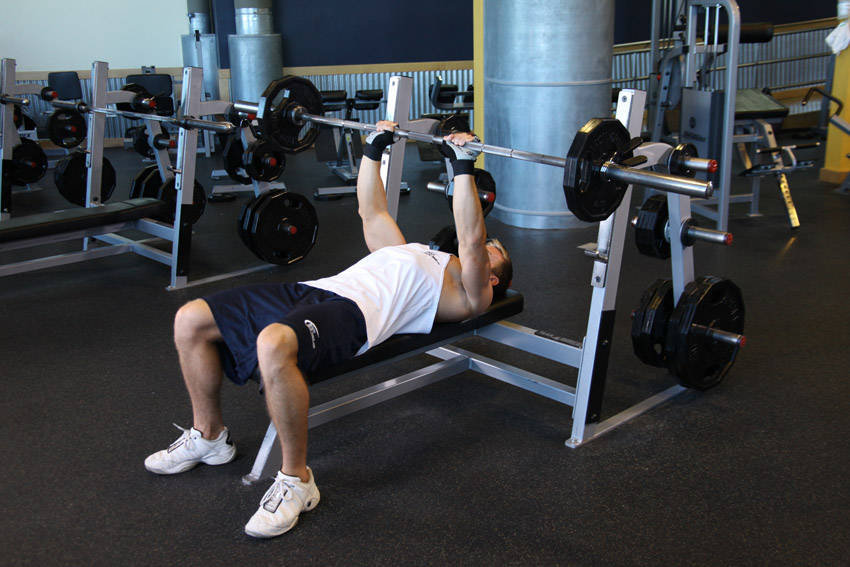

# Close-Grip Bench Press

 

## Cues

Hands shoulder-width apart; elbows within 30° of the torso.

## Setup

Lie on the bench and grip the bar with your hands about shoulder-width apart, shoulder blades pulled back.

## Steps

1. Unrack the bar and hold it over your shoulders with straight arms.
2. Lower the bar to your lower chest, keeping your elbows tucked close to your body.
3. Press back up until your arms are straight.
