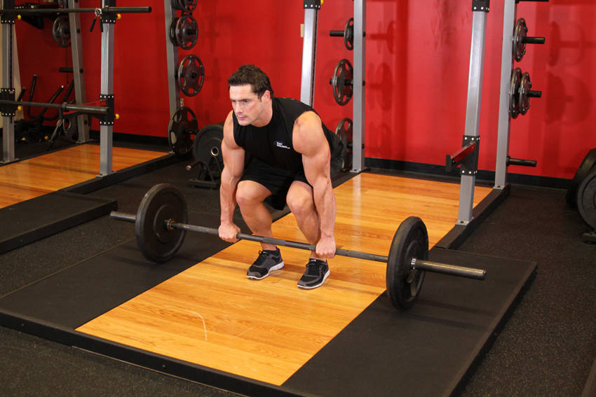
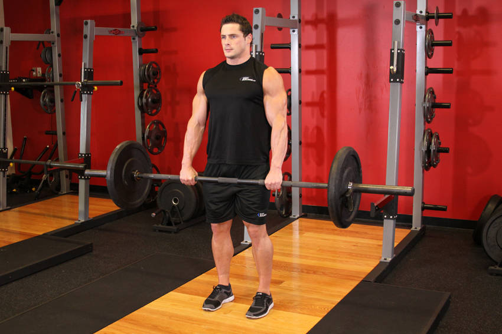

# Deadlift

 

## Cues

Bar over mid-foot, back flat, bar in contact with the legs.

## Setup

Stand with the bar over your mid-foot, feet hip-width apart, and hinge down to grip it just outside your legs, shins touching the bar.

## Steps

1. Flatten your back, breathe in and brace, then pull the slack out of the bar.
2. Push the floor away and stand up with the bar close to your legs, hips and shoulders rising together.
3. Lower by pushing your hips back, bending your knees once the bar passes them.
