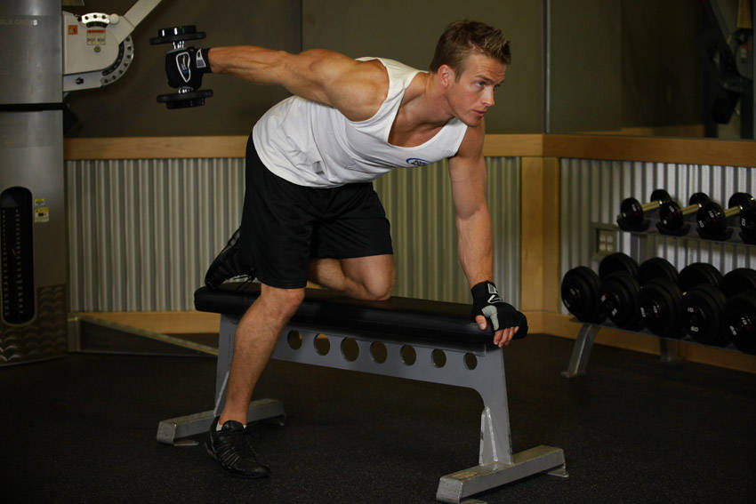
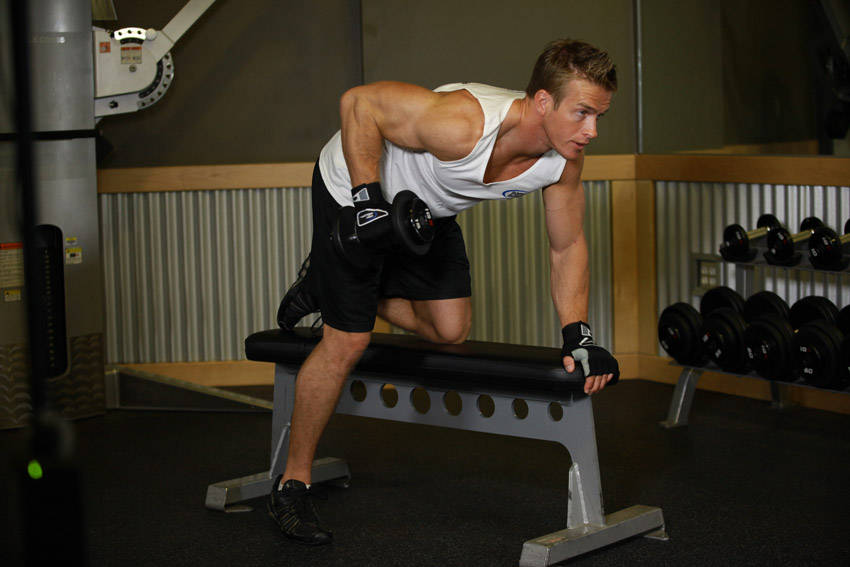

# Dumbbell Kickback

 

## Cues

Upper arm parallel to the floor; arm straight at the top.

## Setup

Put one knee and the same hand on a bench, back flat, and raise the dumbbell until your upper arm is parallel to the floor, elbow bent at 90°.

## Steps

1. Straighten your arm back until it is fully extended.
2. Lower under control, keeping your upper arm still.
3. Switch sides after the set.
