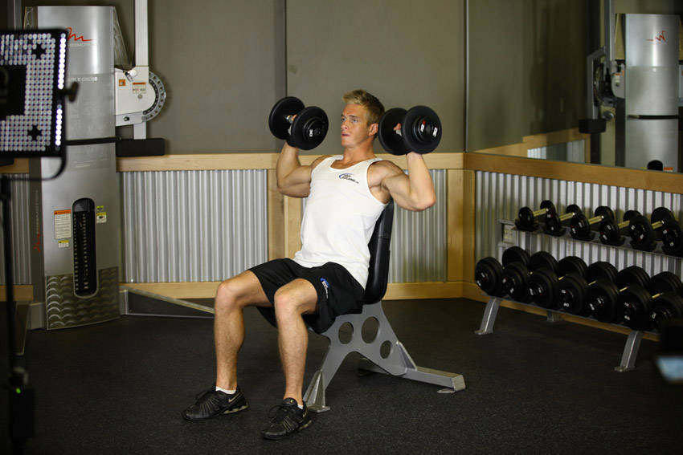
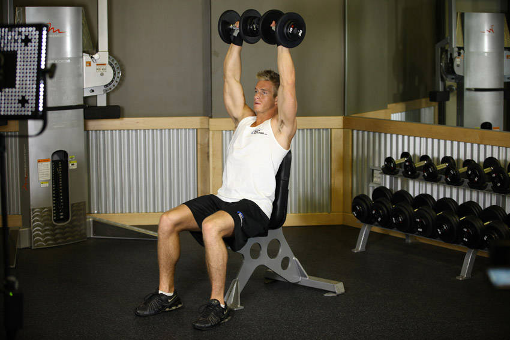

# Dumbbell Shoulder Press

 

## Cues

Lower to ear height; lower back against the bench.

## Setup

Sit on a bench with back support, dumbbells at shoulder height, palms facing forward.

## Steps

1. Press the dumbbells up until your arms are straight overhead.
2. Lower until the dumbbells are at about ear height.
3. Keep your lower back against the pad throughout.
