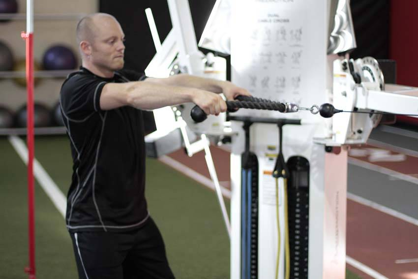
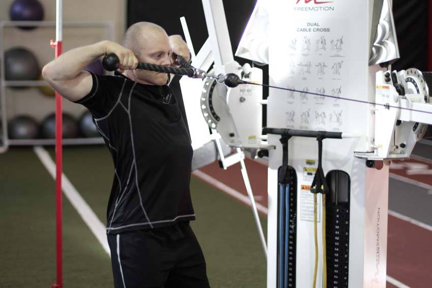

# Face Pull

 

## Cues

Rope at face height; hands finish beside the ears.

## Setup

Attach a rope to a cable at face height, hold the ends with palms facing in, and step back until the cable is under tension.

## Steps

1. Pull the rope towards your face, separating your hands so they end up beside your ears.
2. Squeeze your upper back, then return slowly.
