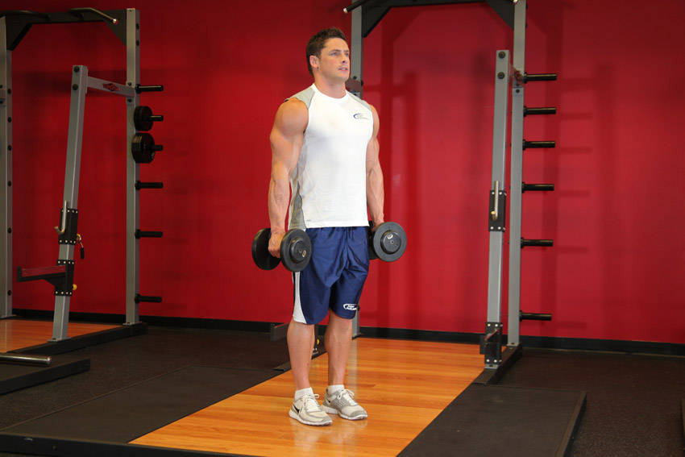
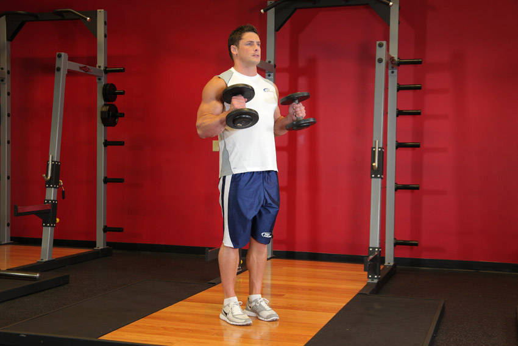

# Hammer Curl

 

## Cues

Palms face each other throughout.

## Setup

Stand with a dumbbell in each hand at your sides, palms facing each other, elbows pinned to your sides.

## Steps

1. Curl the dumbbells up, keeping your palms facing each other.
2. Lower slowly until your arms are straight.
