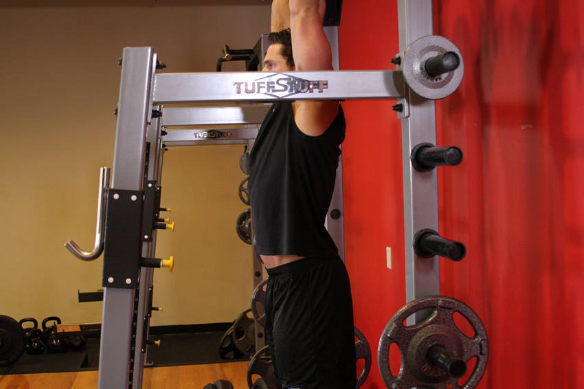
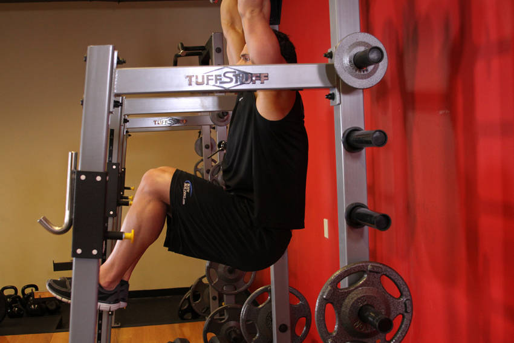

# Hanging Leg Raise

 

## Cues

No swinging; tilt the pelvis up at the top.

## Setup

Hang from a bar with straight arms and your shoulders engaged.

## Steps

1. Raise your legs by curling your pelvis up, with knees bent or straight.
2. Lift until your thighs are at least parallel to the floor.
3. Lower slowly without swinging.
