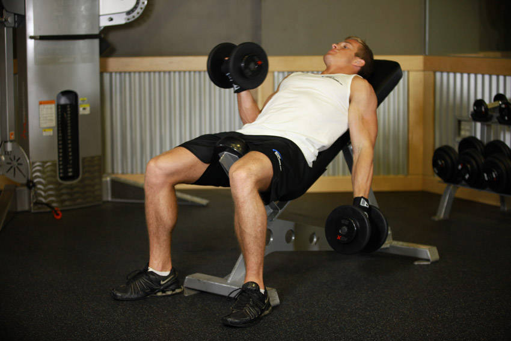
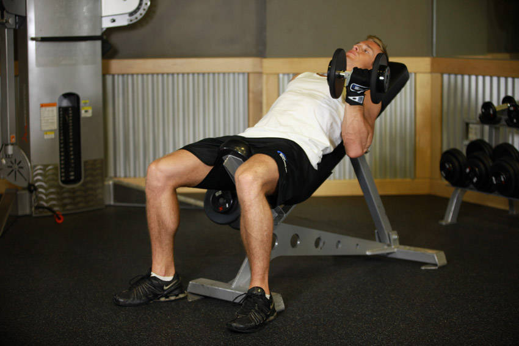

# Incline Dumbbell Curl

 

## Cues

Bench at 45–60°; arms hang vertically at the start.

## Setup

Set a bench to about 45° and sit back with a dumbbell in each hand, arms hanging straight down behind your body, palms forward.

## Steps

1. Curl the dumbbells up without moving your upper arms.
2. Lower slowly to a full stretch.
