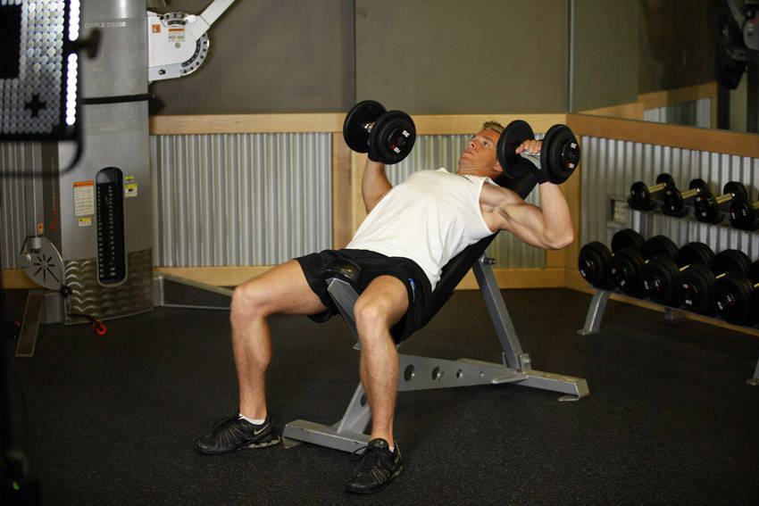
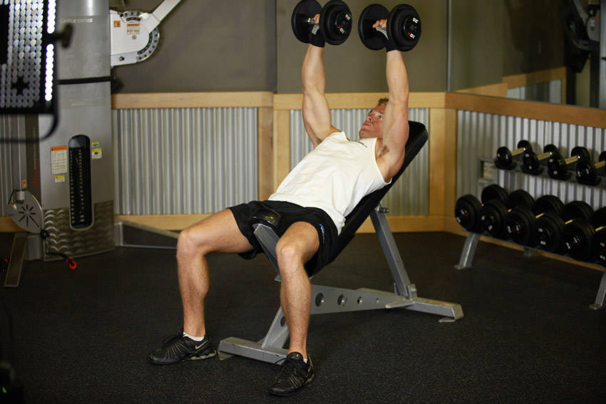

# Incline Dumbbell Press

 

## Cues

Bench at 30–45°, elbows at 45° to the torso.

## Setup

Set the bench to 30–45° and sit back with a dumbbell on each thigh.

## Steps

1. Kick the dumbbells up to your shoulders as you lie back, palms facing forward.
2. Lower until the dumbbells are level with your upper chest, elbows slightly tucked.
3. Press up and slightly together until your arms are straight.
