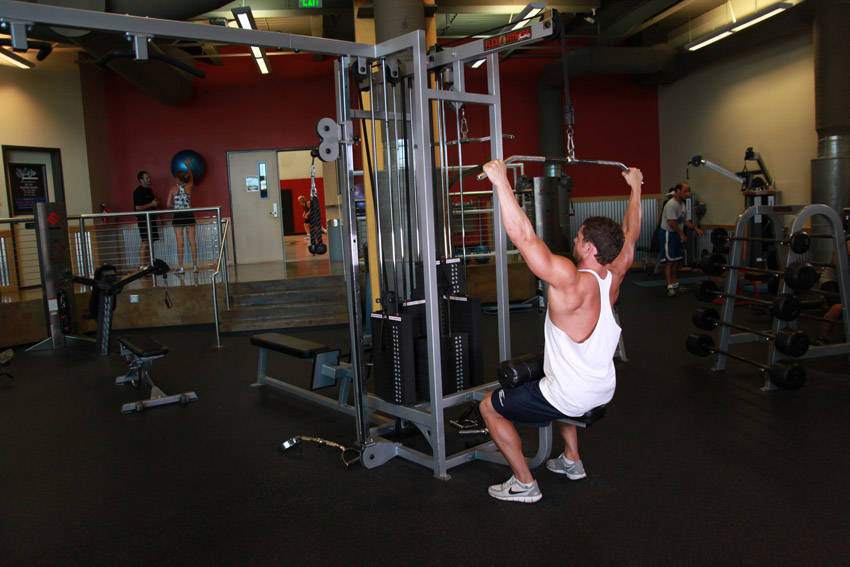
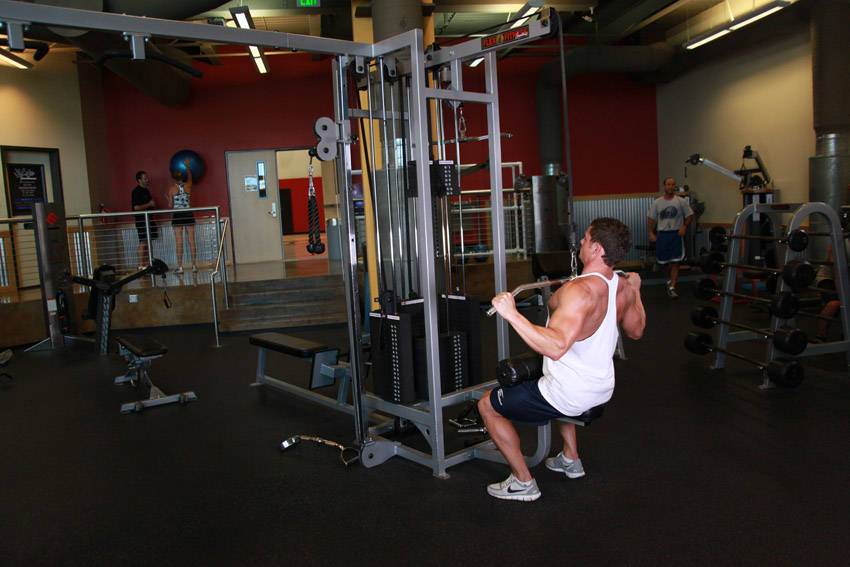

# Lat Pulldown

 

## Cues

Torso leaning back 15°, bar to the upper chest.

## Setup

Lock your thighs under the knee pad and grip the bar wider than your shoulders.

## Steps

1. Lean back slightly with your chest up.
2. Pull the bar to your upper chest, driving your elbows down and back.
3. Let the bar rise slowly until your arms are straight.
