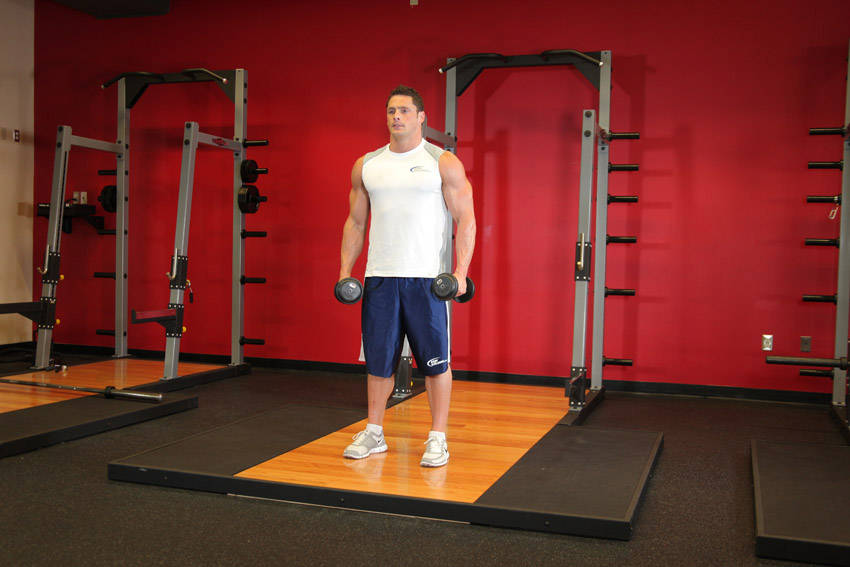
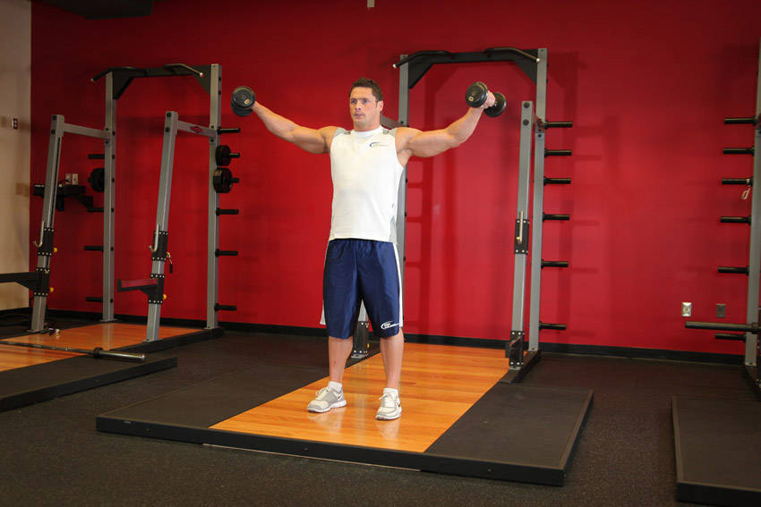

# Lateral Raise

 

## Cues

Elbows bent 10–15°; raise to shoulder height.

## Setup

Stand with a dumbbell in each hand at your sides, elbows slightly bent.

## Steps

1. Raise your arms out to the sides, leading with your elbows.
2. Stop at shoulder height.
3. Lower slowly, and don't swing to start the next rep.
