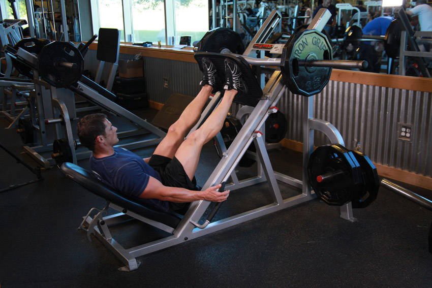
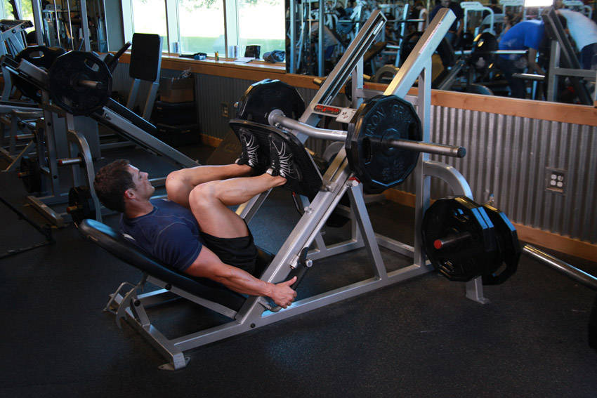

# Leg Press

 

## Cues

Lower back against the pad; knees not locked at the top.

## Setup

Sit with your back flat against the pad, feet shoulder-width apart on the platform, and release the safety handles.

## Steps

1. Lower the platform until your knees are at about 90°, without your lower back lifting off the pad.
2. Press back up without locking your knees.
