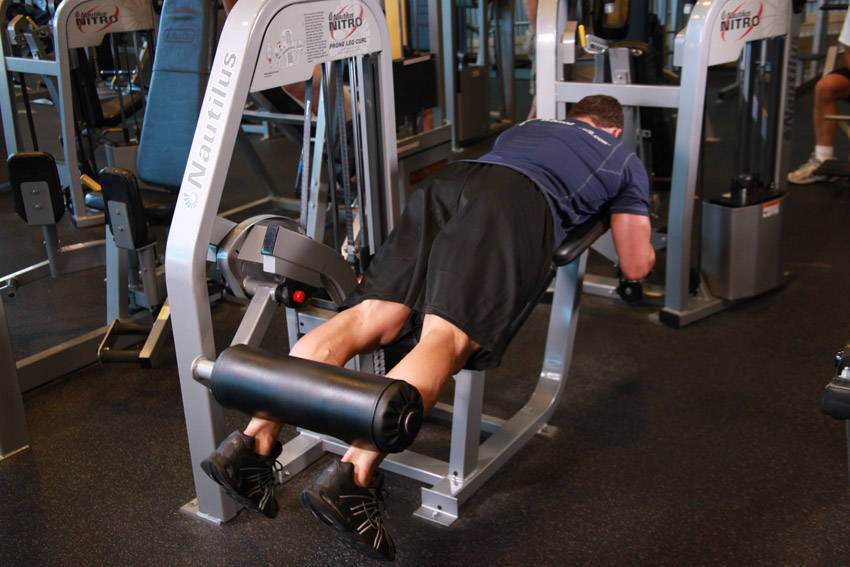
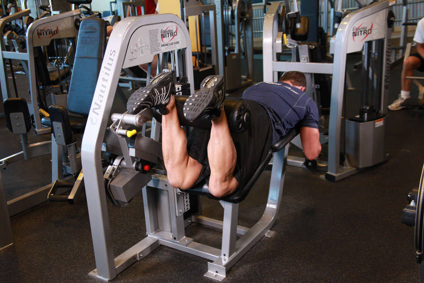

# Lying Leg Curl

 

## Cues

Hips pressed against the pad.

## Setup

Lie face down on the machine with the pad just above your heels, knees just off the bench, and press your hips into the pad.

## Steps

1. Curl your heels towards your glutes as far as you can.
2. Lower slowly until your legs are almost straight.
