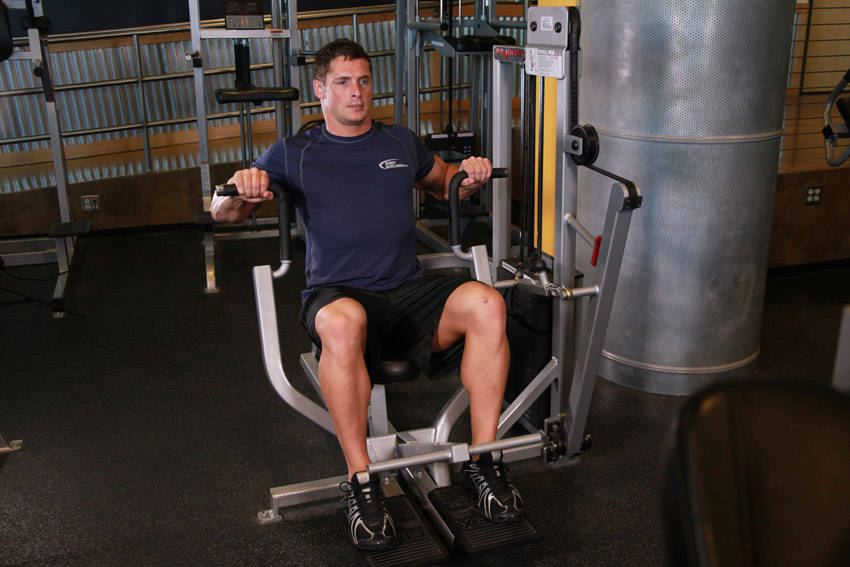
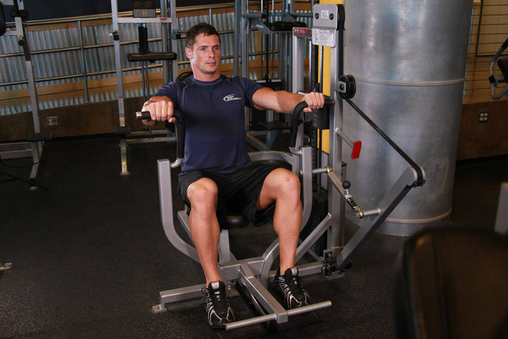

# Machine Chest Press

 

## Cues

Handles level with mid-chest, shoulder blades against the pad.

## Setup

Adjust the seat so the handles are level with your mid-chest, and sit with your back against the pad and shoulder blades pulled back.

## Steps

1. Press the handles forward until your arms are straight, without locking out hard.
2. Return slowly until you feel a stretch in your chest.
