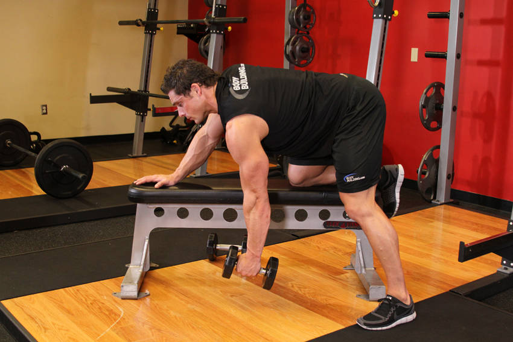
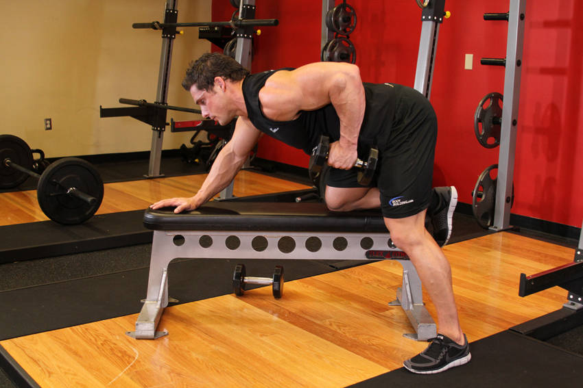

# One-Arm Dumbbell Row

 

## Cues

Back flat, dumbbell to the hip.

## Setup

Put one knee and the same hand on a bench, back flat, holding the dumbbell in your free hand with your arm straight.

## Steps

1. Pull the dumbbell towards your hip, keeping your elbow close to your body.
2. Lower under control to a full stretch.
3. Switch sides after the set.
