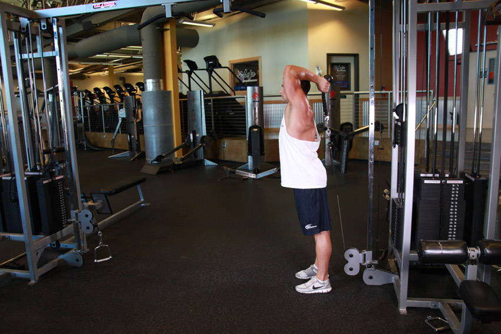
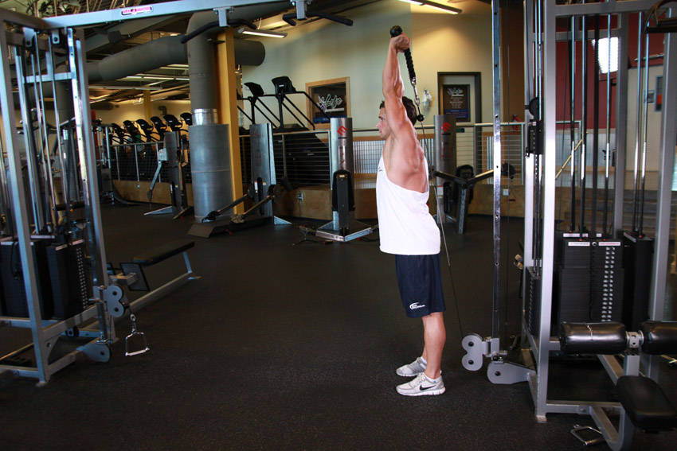

# Overhead Cable Extension

 

## Cues

Elbows pointing forward; hands behind the head at the bottom.

## Setup

Attach a rope to a low pulley, hold it behind your head facing away from the machine, and step into a split stance with your elbows pointing forward.

## Steps

1. Straighten your arms overhead.
2. Lower slowly behind your head to a full stretch, keeping your upper arms still.
