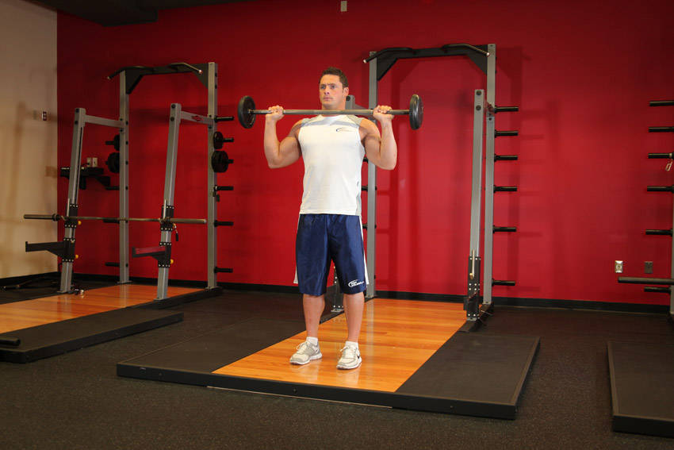
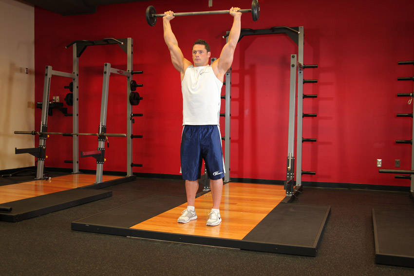

# Overhead Press

 

## Cues

Glutes and abdominals contracted; bar moves in a vertical line.

## Setup

Hold the bar at your collarbones, hands just outside your shoulders, elbows slightly in front of the bar, glutes squeezed and core braced.

## Steps

1. Press the bar straight up, moving your head back to let it pass.
2. Finish with the bar over your mid-foot and your head through.
3. Lower under control to your collarbones.
