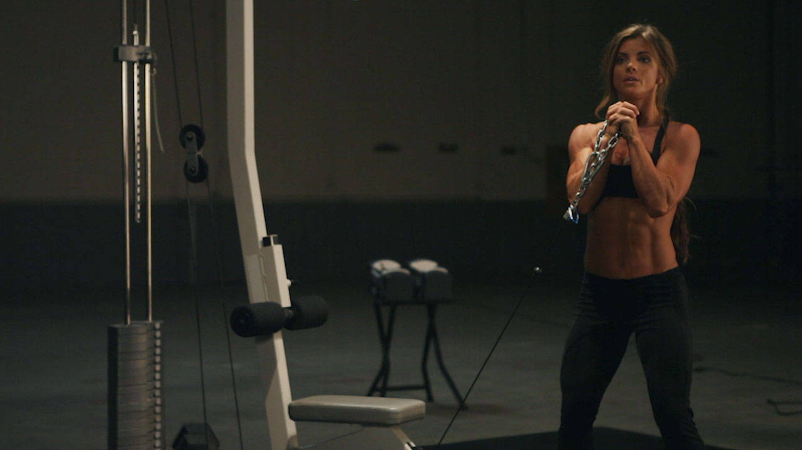
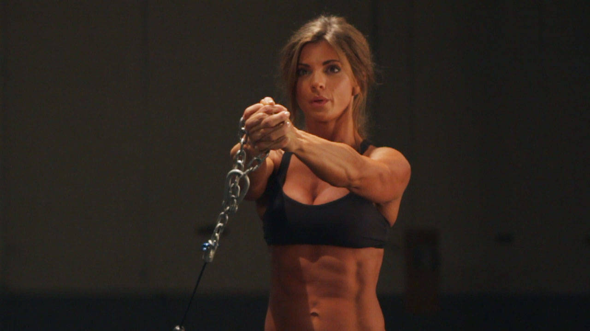

# Pallof Press

 

## Cues

The torso does not rotate.

## Setup

Set a cable handle at chest height, stand side-on to the machine and hold the handle at your chest, stepping away until there is tension.

## Steps

1. Press the handle straight out and hold for a moment, resisting being twisted towards the machine.
2. Bring the handle back to your chest.
3. Switch sides after the set.
