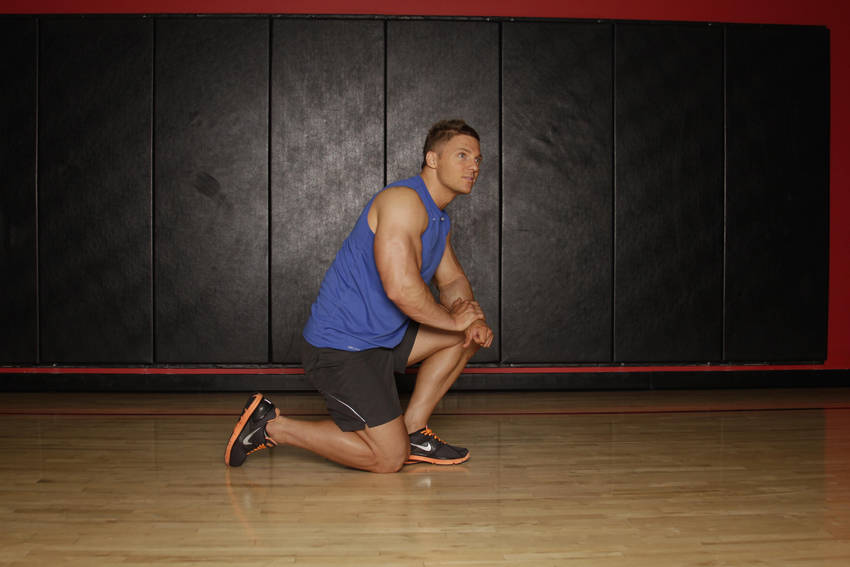
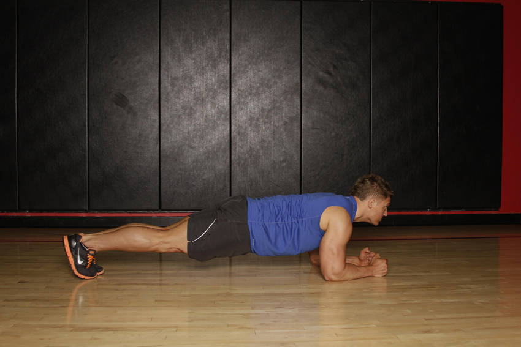

# Plank

 

## Cues

Straight line from head to heels. Log seconds as reps.

## Setup

Rest on your forearms and toes, elbows under your shoulders, body in a straight line from head to heels.

## Steps

1. Brace your core and squeeze your glutes.
2. Hold for the target time, breathing steadily.
3. Log seconds as reps.
