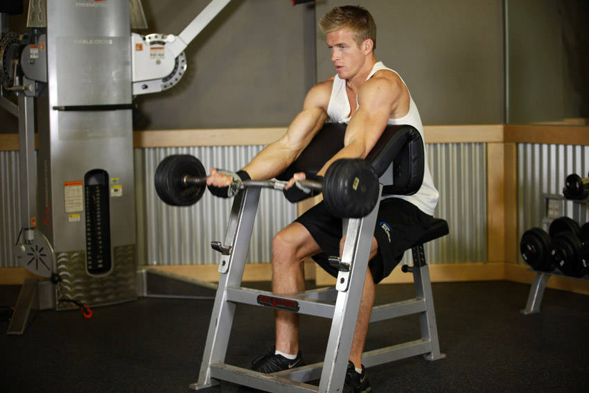
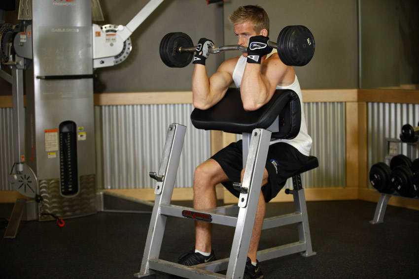

# Preacher Curl

 

## Cues

Upper arms on the pad; lower until the arms are straight.

## Setup

Sit at the preacher bench with your armpits against the top of the pad, holding the bar with an underhand, shoulder-width grip.

## Steps

1. Curl the bar up until your forearms are nearly vertical.
2. Lower slowly until your arms are almost straight, without bouncing at the bottom.
