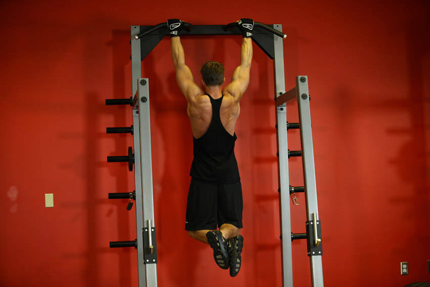
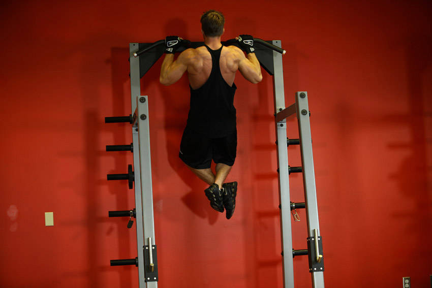

# Pull-Up

 

## Cues

Start with straight arms; finish with the chin above the bar.

## Setup

Hang from the bar with an overhand grip slightly wider than your shoulders.

## Steps

1. Pull your shoulder blades down, then pull your chest towards the bar.
2. Go up until your chin clears the bar.
3. Lower all the way to straight arms under control.
