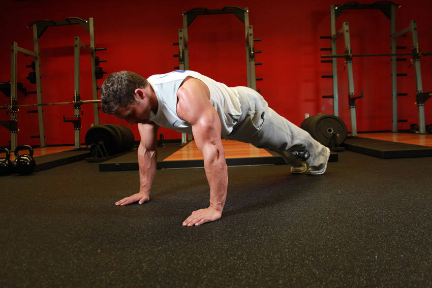
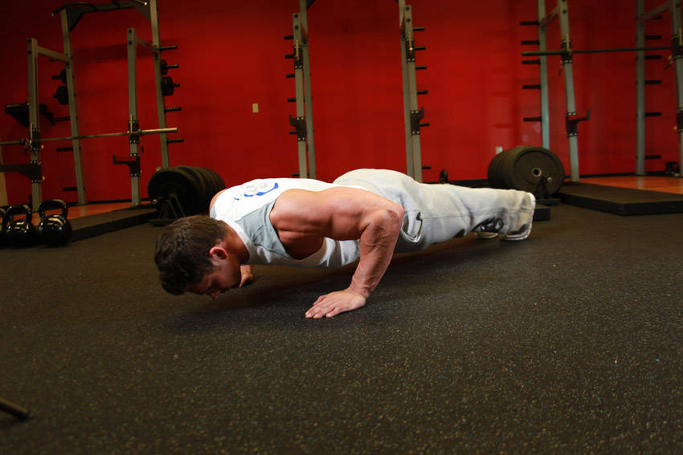

# Push-Up

 

## Cues

Body in a straight line from head to heels; chest to 5 cm above the floor.

## Setup

Hands slightly wider than your shoulders, body straight from head to heels, core braced and glutes squeezed.

## Steps

1. Lower your chest to just above the floor, elbows about 45° from your body.
2. Push back up to straight arms without letting your hips sag.
