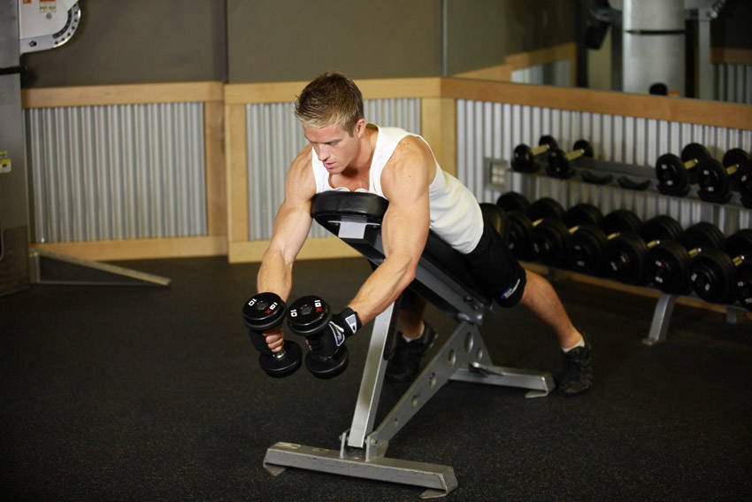
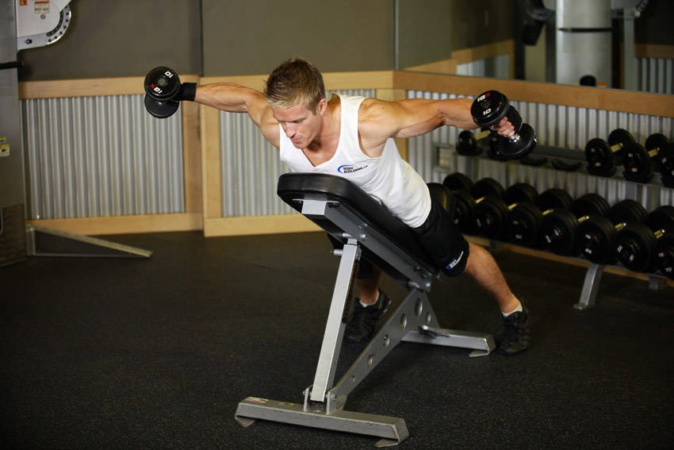

# Reverse Fly

 

## Cues

Torso parallel to the floor, elbows bent 10–15°.

## Setup

Hold a dumbbell in each hand and hinge forward until your torso is nearly parallel to the floor, dumbbells hanging below your chest with soft elbows.

## Steps

1. Raise your arms out to the sides until they are level with your body.
2. Squeeze your shoulder blades together, then lower slowly.
