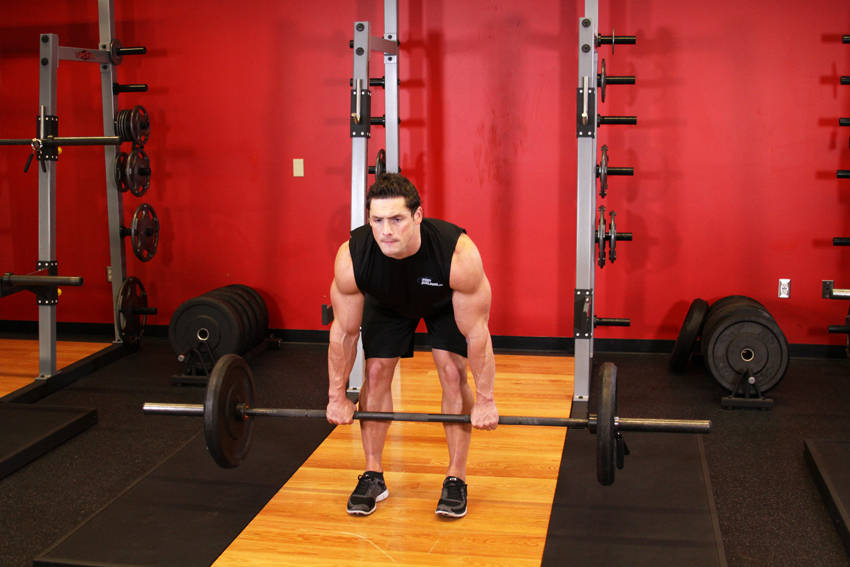
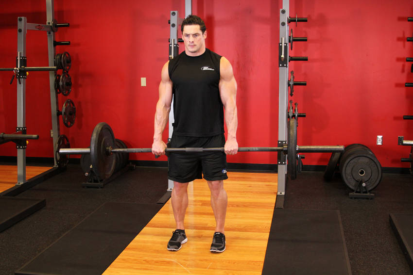

# Romanian Deadlift

 

## Cues

Knees bent 15–20°; hips move back; bar in contact with the legs.

## Setup

Stand holding the bar at your hips with a shoulder-width grip, knees slightly bent.

## Steps

1. Push your hips back and let the bar slide down your thighs, back flat.
2. Stop when you feel a strong stretch in your hamstrings, usually just below the knees.
3. Drive your hips forward to stand back up.
