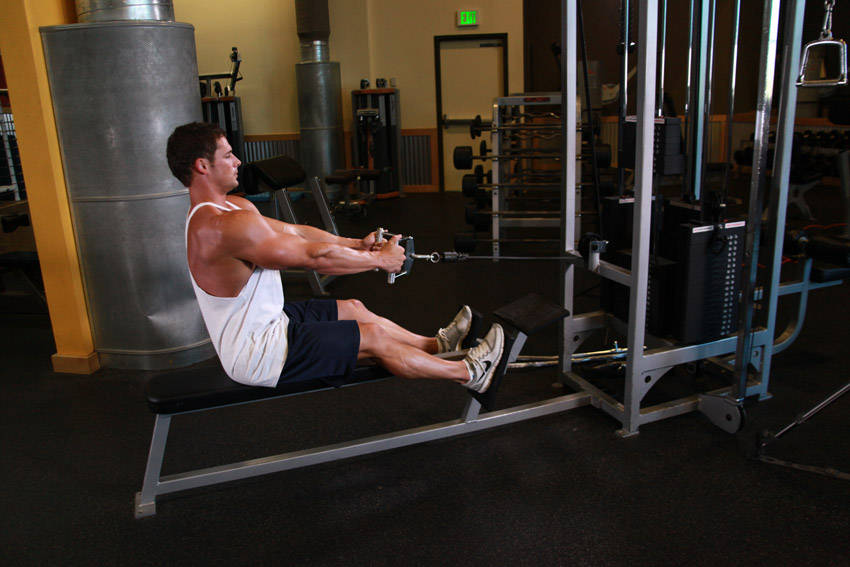
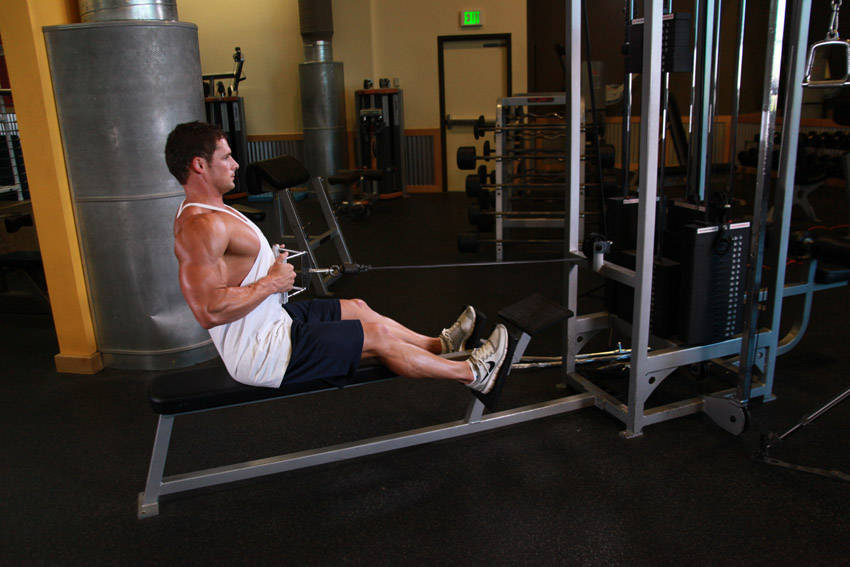

# Seated Cable Row

 

## Cues

Torso upright, handle to the navel.

## Setup

Sit with your feet on the platform and knees slightly bent, chest up, holding the handle with straight arms.

## Steps

1. Pull the handle to your stomach, squeezing your shoulder blades together.
2. Return slowly, letting your shoulders reach forward without rounding your lower back.
