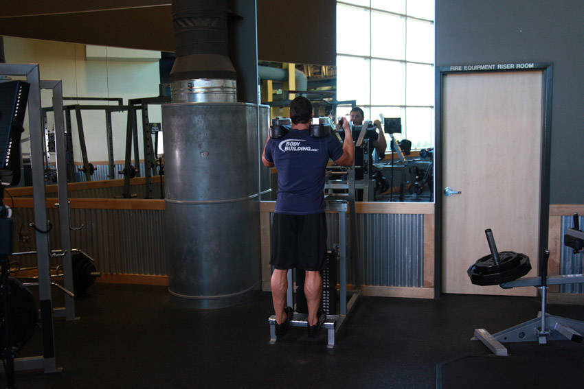
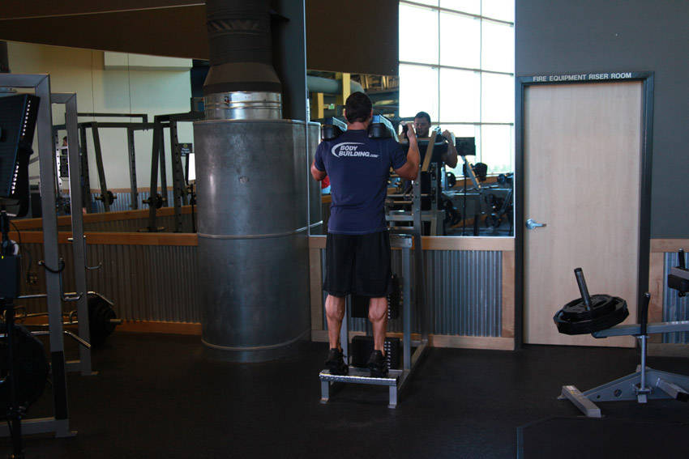

# Standing Calf Raise

 

## Cues

Heels below the platform at the bottom; 1-second pause at the top.

## Setup

Stand with the balls of your feet on the platform and the pads on your shoulders.

## Steps

1. Lower your heels as far as you can for a full stretch.
2. Rise onto your toes as high as you can.
3. Pause at the top, then lower slowly.
