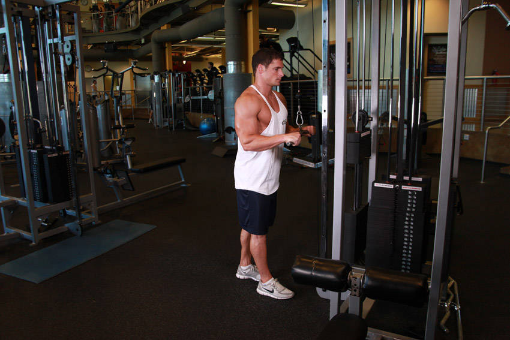
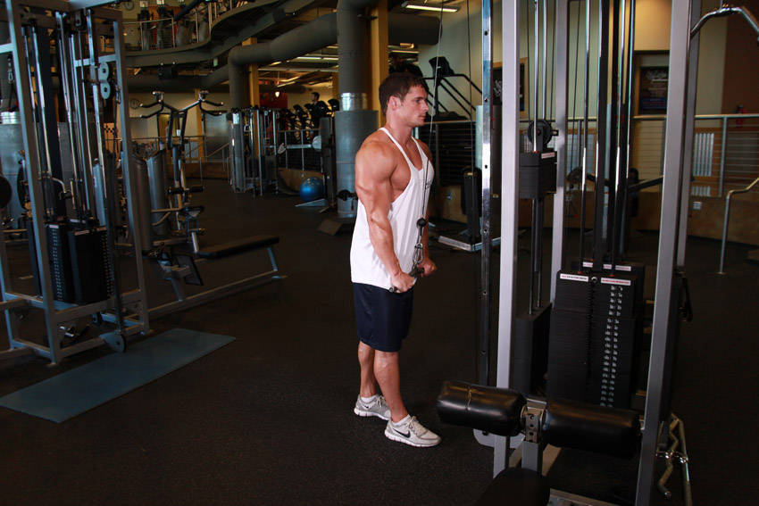

# Tricep Pushdown

 

## Cues

Upper arms fixed at the sides; arms straight at the bottom.

## Setup

Attach a bar or rope to a high pulley, grip it with your elbows at your sides and lean forward slightly.

## Steps

1. Push down until your arms are fully straight, keeping your elbows still.
2. Let the weight rise slowly until your forearms pass horizontal.
